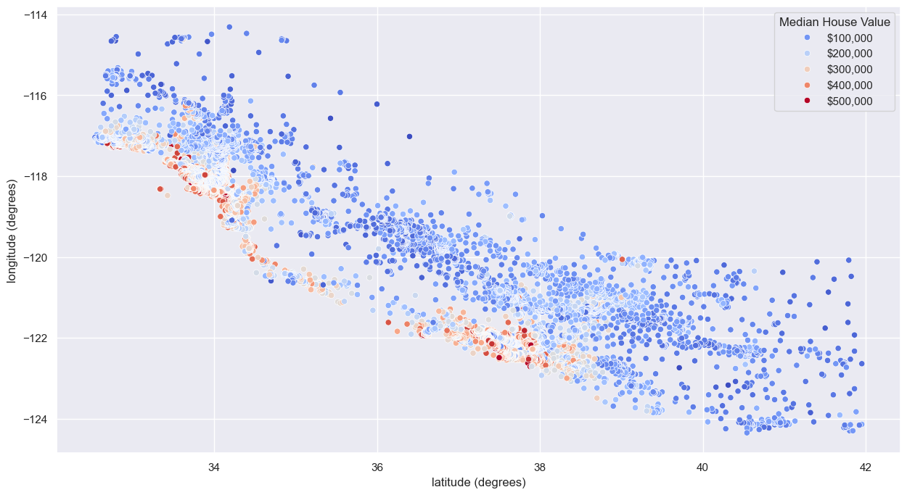
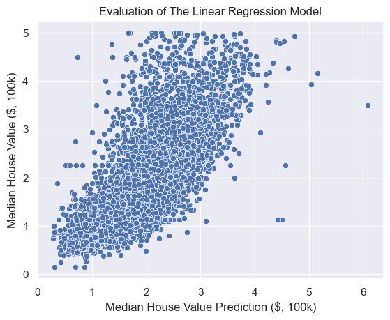

# 🏡 Predicting California House Prices

**A Python-based multiple linear regression project** — performing an EDA, engineering features, and building and evaluating a linear regression model to predict California house prices. The analysis was performed using the public [California Housing Prices Dataset](https://www.kaggle.com/datasets/camnugent/california-housing-prices) from Kaggle.

---

## 📖 Introduction

My third portfolio project. It builds further into data science-focused work, after two previous data analyst-style projects: SQL analysis on the [Olist E-Commerce dataset](https://github.com/nicolascrifasi1603/olist-ecommerce-analysis), and a Python EDA on the [Spotify Tracks Dataset](https://github.com/nicolascrifasi1603/Spotify-EDA-Python). Here I wanted hands-on experience with predictive modelling and machine learning, using the scikit-learn toolkit. This builds on my EDA skills from the last project — going beyond just understanding a dataset, to using it to train a model and make predictions. I picked the California Housing Prices Dataset from Kaggle for this.

---

## 🧠 Key Skills Demonstrated

| Skill | Where I used it |
|---|---|
| 🎯 **Feature selection** | Selected features based on correlation strength with `median_house_value` (e.g. `median_income` at 0.64). Ruled out others for weak/non-linear relationships (`latitude`, `longitude`) or multicollinearity risk (`total_rooms`, `total_bedrooms`, `population`, and `households` were all strongly correlated with each other). Iterated on the feature set across model runs, tracking the impact of adding/removing features on coefficients and R². |
| 🤖 **Predictive modelling with scikit-learn** | Split the data with `train_test_split`, trained a `LinearRegression` model on `X_train`/`y_train`, and used it to generate predictions on unseen `X_test` data. |
| 🔧 **Feature engineering** | Engineered `rooms_per_household` and `population_per_household` from four highly correlated raw columns to avoid multicollinearity. This kept the underlying information, but in a more meaningful, per-household form. One-hot encoded the categorical `ocean_proximity` feature, dropping one category to avoid the dummy variable trap. |
| 📏 **Model evaluation** | Evaluated model performance using R², MSE, and RMSE. Checked for multicollinearity among final features using Variance Inflation Factor (VIF) scores. Then diagnosed the model further with residual distribution plots and residuals/predictions plotted against actual house values, to check for patterns like heteroscedasticity. |

---

## 🚀 Project Overview

**Question:**
> Which features are most strongly correlated with median house value in California, and can a linear regression model reliably use them to predict it?

The objectives of this project were to:

1. 🔍 Perform an EDA to better understand the dataset, the features available, and gain confidence in selecting the right features for the model.
2. 🧹 Clean and transform the data to enable the linear regression model to fit the data as well as possible.
3. 🔧 Engineer features that best capture what drives California house value.
4. 📈 Build a multiple linear regression model to predict California house value for given features.
5. 📏 Evaluate the performance of the model using common evaluation metrics.

---

## 🔄 Project Workflow

| Step | What I did |
|---|---|
| 📥 **Imports & load** | Imported the dataset into a Jupyter notebook alongside the required packages (pandas, numpy, matplotlib, seaborn, scikit-learn, statsmodels). |
| 👀 **Data understanding** | Got a first look at the data with `.shape`, `.head()`, `.dtypes`, and `.describe()`. |
| 🧹 **Data preparation** | Imputed 207 missing values in `total_bedrooms` with the median. The column was right-skewed (mean of 538 vs. median of 435), making the median the more robust choice. Also removed rows where `median_house_value` was capped at $500,001. |
| 📊 **Feature understanding & relationships** | Examined the distribution of every feature, and its correlation with `median_house_value` and with other features. Used a correlation heatmap and pairplots to begin the feature selection process. |
| 🔤 **One-hot encoding** | One-hot encoded `ocean_proximity` so the model could process it numerically, dropping one category to avoid the dummy variable trap. |
| 🔧 **Feature engineering** | Calculated `rooms_per_household` and `population_per_household` from raw count columns, and used these in place of the original, highly correlated columns. |
| 📈 **Building the linear regression model** | Selected `median_income`, `rooms_per_household`, and the one-hot encoded ocean proximity columns as final features. Split the data 70/30 with `train_test_split`, then fit a `LinearRegression` model on the training set to generate predictions on the test set. |
| 📏 **Evaluating the model** | Checked for multicollinearity in the final feature set using VIF scores. Evaluated overall model fit with R², MSE, and RMSE. Analysed residual plots (residuals distribution, residuals vs. actual value, predictions vs. actual value) to understand where and how the model's predictions broke down. |

---

## 🗂️ Dataset Overview

- **Source:** [California Housing Prices Dataset](https://www.kaggle.com/datasets/camnugent/california-housing-prices) (Kaggle)
- **Size:** 20,640 rows, 10 columns
- **Features:** `longitude`, `latitude`, `housing_median_age`, `total_rooms`, `total_bedrooms`, `population`, `households`, `median_income`, `median_house_value`, `ocean_proximity`

---

## 💡 Key Findings

### The Model

$$
\hat{y}_{\text{median house value}} = 84{,}712.56 + 35{,}003.43 \cdot x_{\text{median income}} - 51.37 \cdot x_{\text{rooms per household}} - 72{,}489.84 \cdot x_{\text{INLAND}} + 16{,}157.72 \cdot x_{\text{NEAR OCEAN}} + 14{,}292.07 \cdot x_{\text{NEAR BAY}}
$$

| Feature | Coefficient |
|---|---|
| `median_income` | 35,003.43 |
| `rooms_per_household` | −51.37 |
| `ocean_proximity_INLAND` | −72,489.84 |
| `ocean_proximity_NEAR OCEAN` | 16,157.72 |
| `ocean_proximity_NEAR BAY` | 14,292.07 |

*(baseline category: `<1H OCEAN`)*

### Insights

- `median_income` is by far the strongest predictor in the model. A $10,000 increase in median income is associated with a ~$35,000 increase in predicted median house value, holding other features constant.
- Location matters, but not linearly. Raw `latitude`/`longitude` weren't useful as linear predictors, but `ocean_proximity` was: houses further inland are worth substantially less than the coastal baseline, while houses near the ocean or bay see a smaller positive effect.



Hotspots of expensive houses cluster along the coastline — most visibly around the Los Angeles basin and the San Francisco Bay Area — with prices dropping off further inland.

- `rooms_per_household` has a negative coefficient, despite a slightly positive raw correlation (0.11) with house value. This isn't multicollinearity — VIF scores for all features were under 1.35. Instead, once `median_income` is controlled for, the leftover signal is negative: among areas with similar income, a higher rooms-per-household ratio is associated with *lower* house value. This likely reflects a location-premium effect — dense, high-value urban areas tend to have fewer rooms per household than spacious, lower-value inland areas.
- The final model explains **~55% of the variance** (R² ≈ 0.55) in median house value, using `median_income`, `rooms_per_household`, and `ocean_proximity`.
- Residual analysis showed **heteroscedasticity**. The model is considerably more precise for lower-value houses than for expensive ones, and tends to underpredict the most expensive homes — consistent with a linear model struggling to capture the relationship at the top end of the price range. A natural next step would be trying algorithms that can model non-linear relationships more flexibly — **random forests** or **gradient boosting** (e.g. XGBoost) are worth exploring, since both can capture non-linear effects and feature interactions without needing them manually engineered.

### Model Evaluation

| Metric | Value |
|---|---|
| R² | 0.55 |
| MSE | 4,414,786,714.98 |
| RMSE | 66,443.86 |

### Predictions vs. Actual Values



Points cluster tightly around the y = x line at lower values but fan out substantially above ~$400,000, and cluster slightly above the line in that range — confirming the model underpredicts the most expensive homes.

---

## 📁 Repository Structure

```
├── California-house-prices.ipynb   # Full analysis and modelling notebook
├── house_price_predictor_app.py    # Streamlit app for interactive predictions
├── house_price_model.pkl           # Trained model, loaded by the app
├── requirements.txt                # Dependencies for the app
├── images/
│   ├── location_median_house_value.png
│   └── model_evaluation.png
├── README.md
```

---

## 🛠️ How to Use This Project

1. **Clone the repo** and open it in Jupyter or VS Code.
2. **Download the dataset** from Kaggle (linked above) and place it in the project folder — it isn't included in this repo.
3. **Install the required packages** — pandas, numpy, matplotlib, seaborn, scikit-learn, statsmodels.
4. **Run `California-house-prices.ipynb`** from top to bottom to reproduce the full analysis.
5. **Cross-reference the notebook** against the workflow and findings in this README to follow the reasoning behind each step.

---

## 🖥️ Running the Streamlit App

Alongside the analysis, I built a small [Streamlit](https://streamlit.io/) app that loads the trained model and lets you generate a house value prediction from your own inputs, without touching the notebook.

1. **Clone the repo** (if you haven't already) and navigate into the project folder.
2. **Install the app's dependencies:**
   ```
   pip install -r requirements.txt
   ```
3. **Run the app:**
   ```
   streamlit run house_price_predictor_app.py
   ```
4. This opens the app in your browser, where you can enter feature values and get a predicted median house value from the trained model (`house_price_model.pkl`).

---

## 🔗 Connect

If you'd like to discuss this project or data analytics roles, feel free to connect with me on [LinkedIn](http://www.linkedin.com/in/nicolascrifasi).
